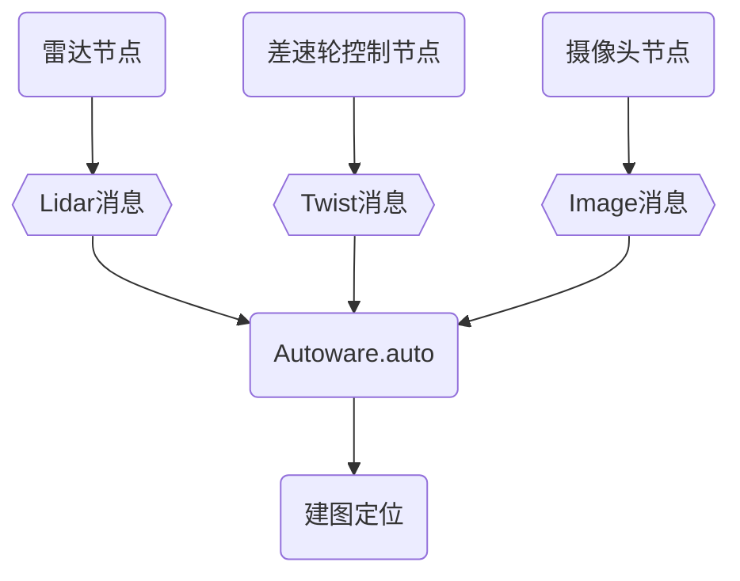
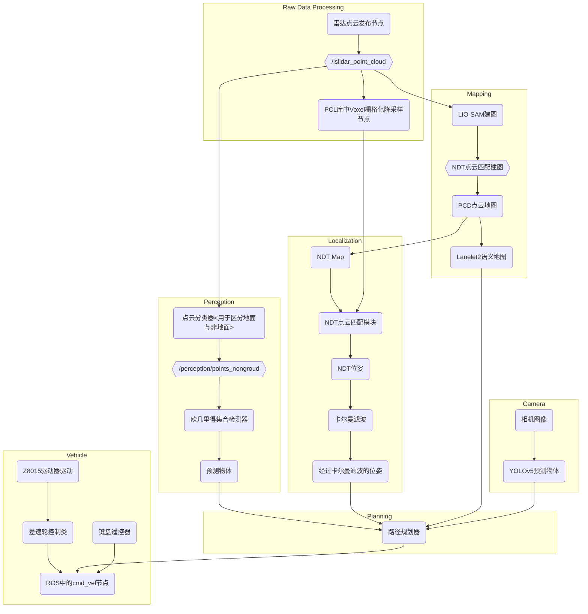
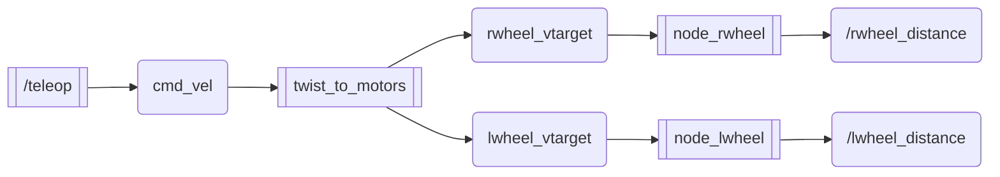

# 基于3D激光雷达与autoware.auto的室内定位建图小车

| **成员** | **吴嘉阳** **徐浩铭** **王松**                               |
| -------- | ------------------------------------------------------------ |
| **相关** | - [autoware.auto官方文档](https://autowarefoundation.gitlab.io/autoware.auto/AutowareAuto/index.html) <br/>- [镭神3d雷达帮助文档]("文稿\镭神智能_C16_V3.0_客户服务资料.zip") |

## 项目成果

1. 实现轮式小车的基本运动控制
2. motor,lidar,camera,imu(已弃用)等传感器的融合
3. 使用LIO_SLAM算法建立3d点云地图
4. 小车模型urdf,pcd点云图,osm矢量地图在rviz中可视化
5. 利用autoware.auto提供的ndt算法实现localization
6. autoware官方室外停车场demo仿真实现


## 项目使用

### 环境准备

​    ubuntu20.04

​	[ROS2-foxy  fishros一键安装](https://github.com/fishros/install)    

​	[autoware.auto](https://www.guyuehome.com/37552)    

### 使用

#### 	  demo1:运动控制

```bash
在dev_ws工作空间下
colcon build
编译

然后
source install/setup.bash
添加环境变量

cd src
```

​		然后运行

```
ros2 launch launch/robot_launch.py
```

#### 	  demo2:建图

```bash
编译且添加环境变量后

ros2 launch launch/mapping_launch.py
```

​		运行结束后会自动保存.pcd后缀的点云文件

#### 	   demo3:实时定位

```bash
进入autoware文件包
cd ~/AutowareAuto
colcon build
source install/setup.bash

ros2 launch autoware_auto_launch autoware_auto_robot_localization.launch.py
```


## 项目架构图

### 设计框架图




### Autoware.auto lgsvl仿真框架图


### 总体框架图



### 项目rqt_graph


轮子节点控制




### 小车TF关系


## 项目中遇到的问题

 1. ros1的py文件移植到ros2 

      解决: 修改头文件,以ros2的方式发布节点和消息,修改部分变化的函数和参数

 2. 建图和定位时imu无法与激光雷达以及差速轮适配

 3. 