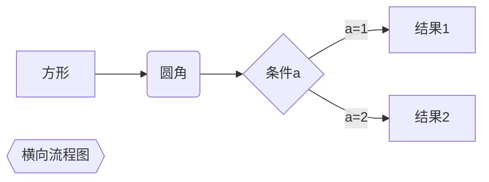
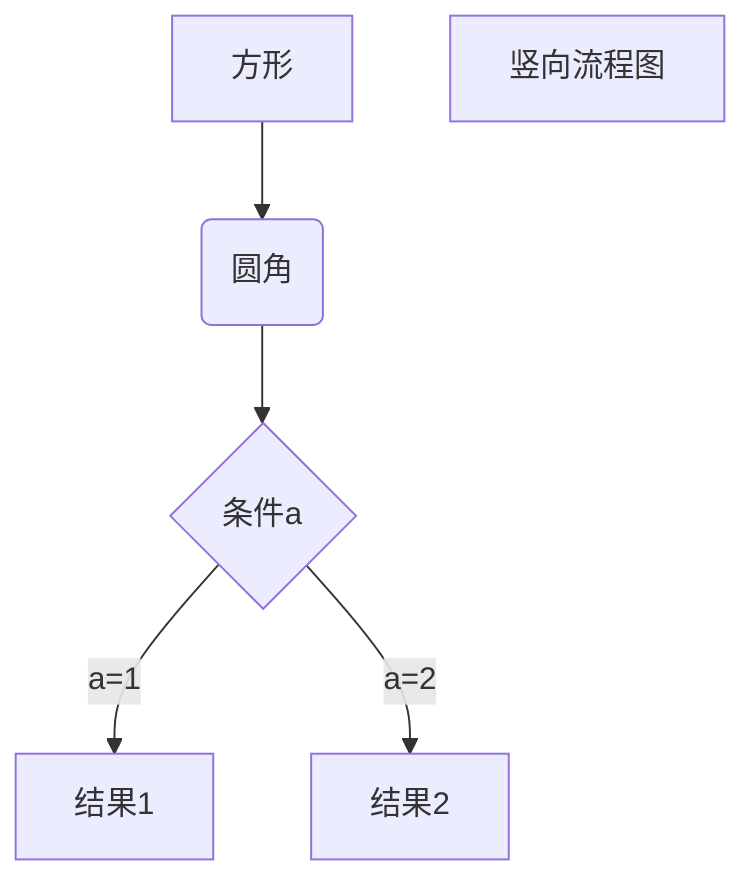
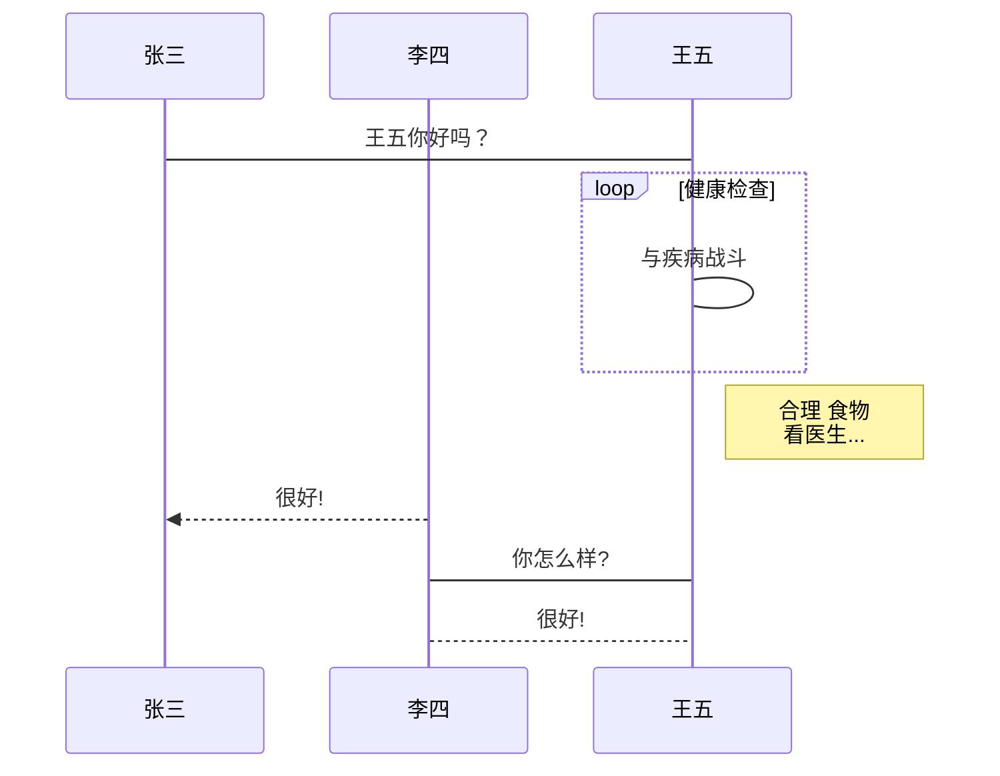
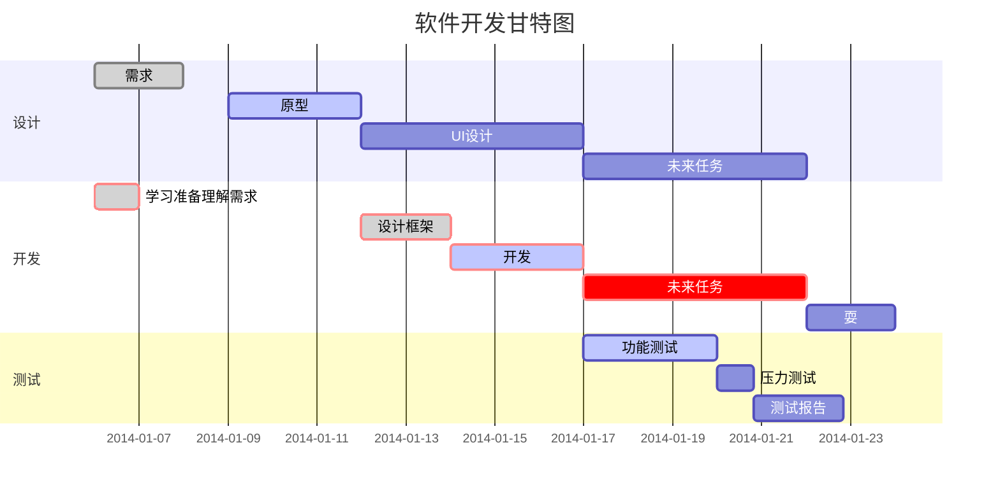

# flowchart

```flow
start=>start: 接受到消息
info=>operation: 读取信息
setCache=>operation: 更行缓存
end=>end: 处理结束
start->info->setCache->end

```

## 简易四步

```flow
st=>start: 开始
op=>operation: 操作
cond=>condition: Yes or No?
e=>end: 结束了
st->op->cond
cond(yes)->e     
cond(no)->op
```

## 简易五步

```flow
start=>start: API请求
cache=>operation: 读取Redis缓存
cached=>condition: 是否有缓存？
sendMq=>operation: 发送MQ，后台服务更新缓存
info=>operation: 读取信息
setCache=>operation: 保存缓存
end=>end: 返回信息

start->cache->cached
cached(yes)->sendMq
cached(no)->info
info->setCache
setCache->end
sendMq->end
```

## 基本语法

基本语法：

- 定义模块 id=>关键字: 描述 （“描述”的前面必须有空格，“=>” 两端不能有空格）
- 关键字：
  - start 流程开始，以圆角矩形绘制
  - opearation 操作，以直角矩形绘制
  - condition 判断，以菱形绘制
  - subroutine 子流程，以左右带空白框的矩形绘制
  - inputoutput 输入输出，以平行四边形绘制
  - end 流程结束，以圆角矩形绘制

- 定义模块间的流向：
  - 模块1 id->模块2 id ：一般的箭头指向
  - 条件模块id (描述)->模块id(direction) ：条件模块跳转到对应的执行模块，并指定对应分支的布局方向

# mermaid







# UML

```sequence
对象A->对象B: 对象B你好吗?（请求）
Note right of 对象B: 对象B的描述
Note left of 对象A: 对象A的描述(提示)
对象B-->对象A: 我很好(响应)
对象A->对象B: 你真的好吗？
```



# 甘特图



